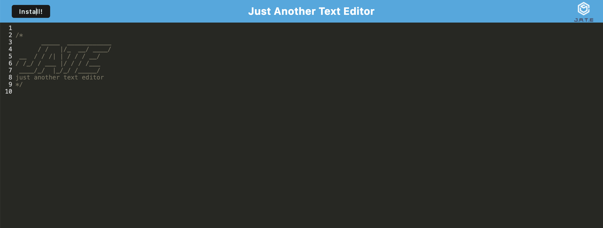

# Texto Edito

## Description

Texto Edito is a text editor for you to record all your notes. This application is a PWA so install it for offline usage!

Deployment: https://textoedito.onrender.com

## Table of Contents 

- [Installation](#installation)
- [Usage](#usage)
- [Credits](#credits)
- [License](#license)

## Installation
npm install & npm run dev

How do I install Dependencies?
npm install

## Usage

Use this app for basic note taking.

## Credits

## License 

This project is licensed under the MIT License.

Find more about this license here: https://opensource.org/licenses/MIT.

        

## Tests

How do I run tests?
No Testing

## Questions

Please direct your questions towards Ben at:
Github: zaczacariah
Email: ben-zac@outlook.com

    